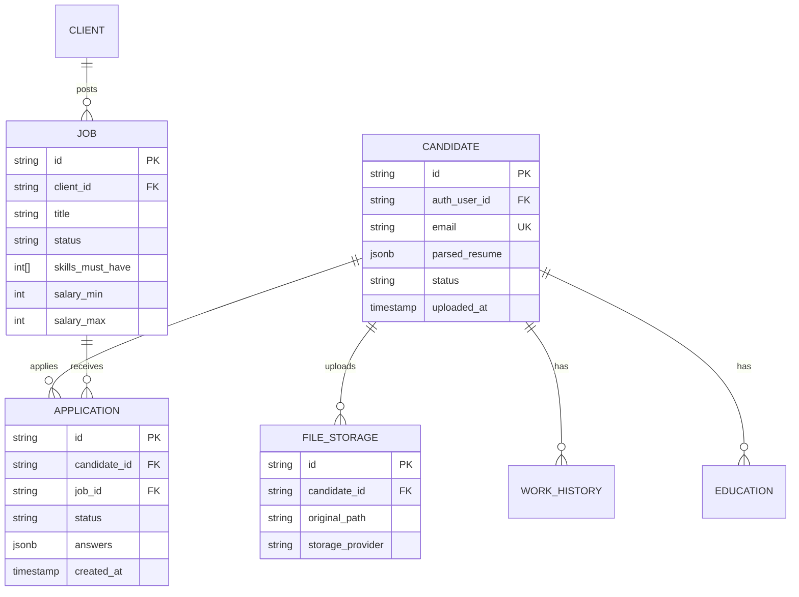

# Board-App Architecture Handbook (for Developers)

> Single source of truth for **features**, **external services**, **data flow**, and **code conventions**.

---

## 1.  High-Level Topology

```
Browser ──HTTPS──► Vercel Edge (Next.js)
                ├─► Supabase (Auth / Postgres / Storage)
                ├─► Upstash Redis (cache / rate-limit / queue)
                └─► Fly.io Container (resume worker)
```

All traffic is **stateless**; workers pull jobs from Postgres queue table via Redis lock.

---

## 2.  Why We Picked Each Service (Plain English)

| Service | Why we chose it | What we’d need to re-write if we drop it |
|---------|-----------------|------------------------------------------|
| **Vercel** | Serverless that auto-scales to 100 k req/min, zero-downtime deploys, global CDN baked in. No servers to patch. | Move to AWS ECS + ALB + CloudFront + Terraform. Weeks of DevOps work. |
| **Supabase** | Managed Postgres with 60-connection pool, row-level security, social auth, file storage in one bill. No RDS + Cognito + S3 glue. | Self-host Postgres + Auth0 + S3 + IAM policies. 3× bills, 5× complexity. |
| **Upstash Redis** | HTTP-based Redis (no connection limit), pay-per-request, 1 GB free. Works from serverless functions. | Run Elasticache → VPC, NAT, security groups, hourly cost even idle. |
| **Fly.io** | Keeps container warm (no cold-start), Mumbai region, free 230 h/mo. One `fly scale count 3` gives load-balancing. | Kubernetes (EKS) → nodes, cluster-autoscaler, Helm, monitoring. 10× cost. |
| **Google Gemini** | Cheapest multi-language model (₹0.005 per resume). Fallback to OpenRouter if quota hit. | Self-host LLM → GPU nodes, model weights, autoscaling. ₹50 k/mo minimum. |
| **Postmark** | Best deliverability for Indian ISPs, 10 k free emails/mo, bounce webhooks. | SES → set up domain reputation, DKIM, bounce handling. Same price, worse UX. |
| **Sentry** | Auto-captures exceptions, cron heartbeats, Slack alerts, 50 k events/mo free. | Self-host Sentry → Postgres + Redis + Kafka. 2 GB RAM always on. |

Bottom line: **every service is the cheapest managed tier that removes an entire layer of DevOps.**  
We can migrate later, but only when we have **dedicated DevOps head-count**.

---

## 3.  Feature Matrix

| Feature | Route/File | Auth | External Service | Critical Path | Notes |
|---------|------------|------|------------------|---------------|-------|
| **Job search** | `/api/public/jobs/search` | none | Postgres + Redis cache | yes | 30 req/min/IP |
| **Job suggestions** | `/api/public/jobs/suggest` | none | Postgres | yes | cached 5 min |
| **Candidate sign-up** | `/auth/callback` | Supabase OAuth | Supabase Auth | yes | Google + OTP |
| **Resume upload** | `/api/candidate/resume/parse` | Bearer JWT | Supabase Storage | yes | 10 MB limit |
| **Resume parsing** | `workers/resume-queue-worker.ts` | service-role | Gemini (+OpenRouter) | yes | async, retry 3× |
| **Apply to job** | `/api/candidate/applications/submit` | JWT | Postgres | yes | idempotent key |
| **Notifications** | `/api/candidate/notifications` | JWT | Postgres | no | polling 30 s |
| **Admin update job** | `/api/admin/jobs/[id]` | JWT + admin-key | Postgres | no | dangerous, locked |
| **Public profile** | `/talent/[slug]` | none | Postgres | no | ISR 60 s |
| **Email sender** | `lib/email.ts` | service | Postmark | no | async, no retry |

---

## 4.  Directory Layout (feature-wise)

```
app/                          – Next.js App Router
├─ api/                       – Route handlers (serverless)
│  ├─ public/jobs/search     – Job discovery (cached, rate-limited)
│  ├─ candidate/*            – All candidate mutating flows
│  ├─ admin/*                – Admin actions (extra key check)
│  └─ health                 – Uptime probe (for Sentry cron)
├─ auth/*                    – OAuth callback & login pages
├─ jobs/[id]/apply           – Application funnel (resume + questions)
├─ dashboard/*               – Post-login SPA (client components)
└─ talent/[slug]             – Public candidate profile (ISR)

components/                   – React UI
├─ auth/                     – Login panels, OTP forms
├─ apply/                    – Multi-step application wizard
├─ dashboard/                – Profile, work history, education
├─ jobs/                     – Job cards, search filters
├─ shell/                    – Layouts, nav, footer
└─ ui/                       – Low-level primitives (Button, Input…)

lib/                          – Pure TS logic, no React
├─ supabase*.ts              – Client singletons (browser, server, SSR)
├─ redis.ts                  – Upstash Redis client
├─ rateLimit.ts              – Sliding-window rate limiters
├─ cache.ts                  – 2-min object cache helper
├─ logger.ts                 – Pino structured logger
├─ email.ts                  – Postmark wrapper
├─ resume-parser.ts          – Gemini/OpenRouter glue
├─ embedding.ts              – Gemini text embeddings
├─ constants/                – Bucket names, regexes
└─ types.ts                  – Shared TS types

workers/                      – Always-on processes
└─ resume-queue-worker.ts    – Polls Postgres, calls Gemini, writes back

supabase/                     – DDL migrations (timestamped)
```

---

## 5.  Data Model (simplified)



---

## 6.  Critical User Flows

### 6.1  Job Search (anonymous)
1. Browser → `/api/public/jobs/search?q=react`  
2. Rate-limit check (Redis)  
3. Cache hit? → return  
4. Postgres FTS query (indexed)  
5. Store page in Redis (120 s)  
6. Return JSON + cursor

### 6.2  Resume Upload (authenticated)
1. Dashboard → drag-drop  
2. Client POST `/api/candidate/resume/parse` (JWT header)  
3. Server validates MIME & size  
4. Generate UUID filename  
5. **Direct upload** to Supabase Storage (signed URL) – not via API  
6. Insert `file_storage` row  
7. Insert `resume_parse_jobs` row (status = queued)  
8. Return 202 + jobId

### 6.3  Resume Parsing (async)
1. Worker polls Postgres every 3 s (batch 10)  
2. Claims row via `SELECT … FOR UPDATE SKIP LOCKED`  
3. Downloads file stream from Storage  
4. Calls Gemini (or OpenRouter)  
5. Writes parsed JSON into `candidates.parsed_resume`  
6. Updates `resume_parse_jobs.status = succeeded`  
7. On error: retry 3×, exponential back-off, then `failed`

### 6.4  Application Submit
1. Candidate clicks “Apply” → `/api/candidate/applications/submit`  
2. Server checks already applied (unique constraint)  
3. Inserts `APPLICATION` row  
4. Sends email (Postmark) async  
5. Returns 201 + applicationId

---

## 7.  Concurrency & Burst Controls

| Resource | Limit | Where | Behaviour |
|----------|-------|-------|-----------|
| Search IP | 30 req/min | `@upstash/ratelimit` | 429 |
| Resume upload | 5 req/min/user | `rateLimit.ts` | 429 |
| Worker batch | 10 jobs | env `WORKER_BATCH_SIZE` | throttled |
| File size | 10 MB | client + API | 413 |
| Postgres conn | 60 (Supabase Pro) | `@supabase/supabase-js` | pool built-in |
| Gemini RPM | 60 (free) | worker | fallback to OpenRouter |

---

## 8.  Caching Strategy

| Layer | TTL | Key Pattern | Invalidation |
|-------|-----|-------------|--------------|
| Redis search | 120 s | `search:<hash(query)>` | automatic expiry |
| Redis suggest | 300 s | `suggest:<text>` | automatic expiry |
| Vercel ISR talent page | 60 s | `talent/<slug>` | on profile update (revalidateTag) |
| Browser static | 1 y | `_next/*` | filename hash |

---

## 9.  Security Checklist

- [ ] All storage buckets **private** (public served via signed URL)  
- [ ] `BOARD_APP_ADMIN_KEY` rotated after deploy  
- [ ] CORS only allows origin `https://yourdomain.com`  
- [ ] Rate-limit on every public route  
- [ ] JWT expiry = 1 h (Supabase default)  
- [ ] Postgres RLS enabled on every table  
- [ ] Service-role key never reaches browser  
- [ ] 2FA on Supabase / Vercel dashboards  
- [ ] GitHub repo protected (main branch rules)

---

## 10.  Observability

| What | Tool | Location | Alert |
|------|------|----------|--------|
| HTTP 5xx | Sentry | auto | > 100/h → Slack |
| Worker alive | Sentry Cron | `/api/cron?source=worker` | miss 2 pings |
| DB CPU | Supabase | dashboard | > 70 % 5 min |
| Redis memory | Upstash | dashboard | > 90 % |
| Function CPU | Vercel | dashboard | > 80 % 5 min |
| Email bounce | Postmark | webhook | > 5 % |

---

## 11.  Code Conventions

- **No console.log** – use `logger.info|error` (structured)  
- **No any** – strict TypeScript (`"strict": true`)  
- **Env vars** validated at runtime with `zod` (optional)  
- **DB queries** always use prepared statements (Supabase)  
- **File names** kebab-case; components PascalCase  
- **API responses** always `{ data?: T, error?: string }`  
- **HTTP status** 200 (success), 201 (created), 429 (rate), 500 (unknown)  
- **Retry** only idempotent calls (GET/PUT)  
- **Secrets** never logged, masked in Sentry extras

---

## 12.  Scaling Levers (when traffic grows)

1. **Search latency ↑** → enable Postgres trigram index or migrate to Typesense  
2. **Vercel CPU ↑** → bump function memory or split heavy routes to Edge  
3. **DB conn saturation** → enable Supabase read-replica, route reads  
4. **Worker backlog** → increase Fly.io VM count (scale count)  
5. **Redis memory ↑** → upgrade to 3 GB, or shorten TTL  
6. **Storage cost ↑** → lifecycle old resumes to S3 Glacier

---

## 13.  Local Development Quick Start

```bash
git clone <repo>
cd board-app
cp .env.example .env.local   # fill keys
npm i
npm run dev                  # Next.js on :3000
npm run worker:resume        # worker in parallel
```

Hot-reload works for both web & worker (tsx).

---

## 14.  FAQ

**Q: Why not AWS Lambda for worker?**  
A: Fly.io keeps container warm + free tier; Lambda cold-start adds 1-2 s poll lag.

**Q: Can I drop Redis?**  
A: Yes, but you lose rate-limit & cache → move rate-limit to Vercel Edge Config (paid).

**Q: Gemini vs OpenRouter cost?**  
A: Gemini 1 M tokens ≈ $0.50; OpenRouter varies by model (Claude-3 ≈ $3). Keep Gemini primary.

---

Keep this doc in sync with code changes; PR template requires updating relevant rows.
